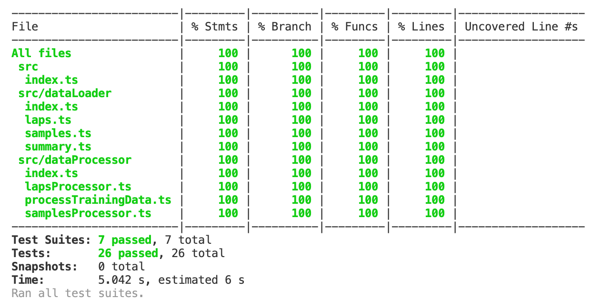

## Assumptions

1. Added to tests `'OUTDOOR_CYCLING'` activityType assuming that for different activityType the two consecutive objects of heartRates samples won't be aggregated.

## Unit tests coverage

